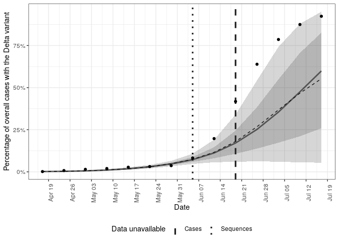

<!-- README.md is generated from README.Rmd. Please edit that file -->

# Forecast case and sequence notifications using variant of concern strain dynamics

[](https://github.com/epiforecasts/forecast.vocs/actions/workflows/R-CMD-check.yaml)
[](https://app.codecov.io/gh/epiforecasts/forecast.vocs)

[](https://epiforecasts.r-universe.dev/)
[](https://github.com/epiforecasts/forecast.vocs/blob/master/LICENSE.md/)
[](https://github.com/epiforecasts/forecast.vocs/graphs/contributors)

[](https://zenodo.org/badge/latestdoi/383161374)

Contains models and tools to produce short-term forecasts for both case
and sequence notifications assuming circulation of either one or two
variants. Tools are also provided to allow the evaluation of the use of
sequence data for short-term forecasts in both real-world settings and
in user generated scenarios.

## Installation

### Installing the package

Install the stable development version of the package with:

``` r
install.packages("forecast.vocs", repos = "https://epiforecasts.r-universe.dev")
```

Install the unstable development from GitHub using the following,

``` r
remotes::install_github("epiforecasts/forecast.vocs", dependencies = TRUE)
```

### Installing CmdStan

If you don’t already have CmdStan installed then, in addition to
installing `forecast.vocs`, it is also necessary to install CmdStan
using CmdStanR’s `install_cmdstan()` function to enable model fitting in
`forecast.vocs`. A suitable C++ toolchain is also required. Instructions
are provided in the [*Getting started with
CmdStanR*](https://mc-stan.org/cmdstanr/articles/cmdstanr.html)
vignette. See the [CmdStanR
documentation](https://mc-stan.org/cmdstanr/) for further details and
support.

``` r
cmdstanr::install_cmdstan()
```

## Quick start

This quick start uses data from Germany that includes COVID-19
notifications and sequences with sequences either being positive or
negative for the Delta variant. It shows how to produce forecasts for
both a one and two strain model for the 19th of June 2021 when the
latest available data estimated that approximately 7% of COVID-19 were
positive for the Delta variant. Note that estimated growth rates and
reproduction numbers shown here have been rescaled using an assumed
generation time of 5.5 days and a weakly informative prior centred
around Delta being 40% more transmissible than non-Delta cases has been
used.

``` r
library(forecast.vocs)
options(mc.cores = 4)

obs <- filter_by_availability(
  germany_covid19_delta_obs,
  date = as.Date("2021-06-19")
)

current_obs <- latest_obs(germany_covid19_delta_obs)
```

### Forecast all-in-one

Run a forecast for both one and two strain models (or optionally just
one of these) using the `forecast()` function. This provides a wrapper
around other package tooling to initialise, fit, and summarise
forecasts. Multiple forecasts can be performed efficiently across dates
and scenarios using `forecast_across_dates()` and
`forecast_across_scenarios()`.

``` r
forecasts <- forecast(obs,
  strains = c(1, 2), voc_scale = c(0.4, 0.2),
  voc_label = "Delta", scale_r = 5.5 / 7,
  adapt_delta = 0.99, max_treedepth = 15,
  refresh = 0, show_messages = FALSE,
)
#> Running MCMC with 4 parallel chains...
#> 
#> Chain 3 finished in 11.3 seconds.
#> Chain 2 finished in 12.0 seconds.
#> Chain 4 finished in 13.6 seconds.
#> Chain 1 finished in 32.6 seconds.
#> 
#> All 4 chains finished successfully.
#> Mean chain execution time: 17.4 seconds.
#> Total execution time: 32.7 seconds.
#> Running MCMC with 4 parallel chains...
#> 
#> Chain 4 finished in 34.3 seconds.
#> Chain 2 finished in 38.3 seconds.
#> Chain 3 finished in 39.0 seconds.
#> Chain 1 finished in 41.6 seconds.
#> 
#> All 4 chains finished successfully.
#> Mean chain execution time: 38.3 seconds.
#> Total execution time: 41.7 seconds.
forecasts
#>    id forecast_date strains overdispersion variant_relationship r_init
#> 1:  0    2021-06-19       1           TRUE               pooled 0,0.25
#> 2:  0    2021-06-19       2           TRUE               pooled 0,0.25
#>    voc_scale error               fit       data  fit_args samples max_rhat
#> 1:   0.4,0.2       <CmdStanMCMC[30]> <list[20]> <list[5]>    4000 1.002723
#> 2:   0.4,0.2       <CmdStanMCMC[30]> <list[20]> <list[5]>    4000 1.005589
#>    divergent_transitions per_divergent_transitons max_treedepth
#> 1:                    10                  0.00250            12
#> 2:                    13                  0.00325            10
#>    no_at_max_treedepth per_at_max_treedepth            posterior
#> 1:                 504               0.1260 <data.table[148x20]>
#> 2:                2998               0.7495 <data.table[400x20]>
#>               forecast
#> 1: <data.table[12x13]>
#> 2: <data.table[54x13]>
```

Unnest posterior estimates from each model.

``` r
posteriors <- unnest_posterior(forecasts)
```

Plot the posterior prediction for cases from the single strain model
(“Overall”), from the two strain model (“Combined”), and the
unobserved estimates for each strain.

``` r
plot_cases(posteriors, current_obs)
```


Plot the posterior prediction for the fraction of cases that have the
Delta variant from the two strain model.

``` r
plot_voc(posteriors, current_obs, voc_label = "Delta variant")
```



Plot the posterior estimate for the growth rate over the mean of the
generation time for COVID-19 cases (here assumed to be 5.5 days).

``` r
plot_growth(posteriors)
```


Plot the posterior estimate for the effective reproduction number of
Delta and non-Delta cases.

``` r
plot_rt(posteriors)
```


Alternatively a list of plots with sensible defaults can be produced
using the following.

``` r
plot_posterior(
  posteriors, current_obs,
  voc_label = "Delta variant"
)
```

### Step by step forecast

Rather than using the all-in-one `forecast()` function individual
package functions can be used to produce a forecast as follows.

``` r
dt <- fv_data(obs, horizon = 4)

model <- fv_model(strains = 2)

inits <- fv_inits(dt, strains = 2)

fit <- fv_sample(
  data = dt, model = model, init = inits,
  voc_scale = c(0.4, 0.2),
  adapt_delta = 0.99, max_treedepth = 15,
  refresh = 0, show_messages = FALSE
)

posterior <- fv_tidy_posterior(fit, voc_label = "Delta", scale_r = 5.5 / 7)
```

As for forecasts produced with the `forecast()` function summary plots
and estimates can then be produced using package functions.

## Citation

If using `forecast.vocs` in your work please consider citing it using
the following,

    #> 
    #> To cite forecast.vocs in publications use:
    #> 
    #>   Sam Abbott (2021). forecast.vocs: Forecast case and sequence
    #>   notifications using variant of concern strain dynamics, DOI:
    #>   10.5281/zenodo.5559016
    #> 
    #> A BibTeX entry for LaTeX users is
    #> 
    #>   @Article{,
    #>     title = {forecast.vocs: Forecast case and sequence notifications using variant of concern strain dynamics},
    #>     author = {Sam Abbott},
    #>     journal = {Zenodo},
    #>     year = {2021},
    #>     doi = {10.5281/zenodo.5559016},
    #>   }

## How to make a bug report or feature request

Please briefly describe your problem and what output you expect in an
[issue](https://github.com/epiforecasts/forecast.vocs/issues). If you
have a question, please don’t open an issue. Instead, ask on our [Q and
A
page](https://github.com/epiforecasts/forecast.vocs/discussions/categories/q-a).

## Contributing

We welcome contributions and new contributors\! We particularly
appreciate help on priority problems in the
[issues](https://github.com/epiforecasts/forecast.vocs/issues). Please
check and add to the issues, and/or add a [pull
request](https://github.com/epiforecasts/forecast.vocs/pulls).

## Code of Conduct

Please note that the `forecast.vocs` project is released with a
[Contributor Code of
Conduct](epiforecasts.io/forecast.vocs/CODE_OF_CONDUCT.html). By
contributing to this project, you agree to abide by its terms.
