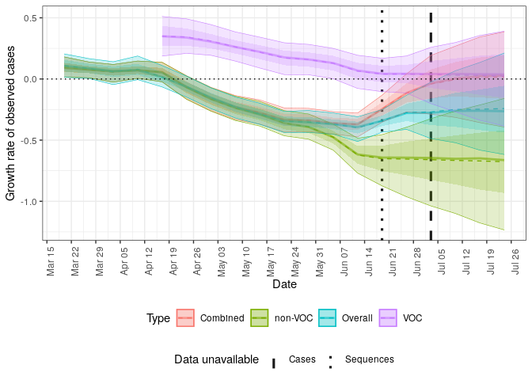

<!-- README.md is generated from README.Rmd. Please edit that file -->

# Forecast case notifications using variant of concern strain dynamics

[](https://github.com/epiforecasts/forecast.vocs/actions/workflows/R-CMD-check.yaml)
[](https://app.codecov.io/gh/epiforecasts/forecast.vocs)

This package contains models and processing code to allow sequencing of
variants of concern to be used to forecast case notifications.

## Installation

Either install the package from GitHub using the following,

``` r
devtools::install_github("epiforecasts/forecast.vocs", dependencies = TRUE)
```

Install stan to enable model fitting and forecasting using:

``` r
cmdstanr::install_cmdstan()
```

## Quick start

This quick start uses data from Germany that includes COVID-19
notificatons and sequences with sequences either being positive or
negative for the Delta variant.

### Step by step forecast

``` r
library(forecast.vocs)
options(mc.cores = 4)

obs <- filter_by_availability(
  germany_covid19_delta_obs,
  date = as.Date("2021-07-05")
)
curr_obs <- latest_obs(germany_covid19_delta_obs)

dt <- stan_data(obs, horizon = 4)

model <- load_model(strains = 2)

inits <- stan_inits(dt, strains = 2)

fit <- stan_fit(
  data = dt, model = model, init = inits,
  adapt_delta = 0.99, max_treedepth = 15,
  refresh = 0, show_messages = FALSE
)
#> Running MCMC with 4 parallel chains...
#> 
#> Chain 4 finished in 42.2 seconds.
#> Chain 2 finished in 43.4 seconds.
#> Chain 3 finished in 47.5 seconds.
#> Chain 1 finished in 55.6 seconds.
#> 
#> All 4 chains finished successfully.
#> Mean chain execution time: 47.2 seconds.
#> Total execution time: 55.7 seconds.
#> 
#> Warning: 15 of 4000 (0.0%) transitions ended with a divergence.
#> This may indicate insufficient exploration of the posterior distribution.
#> Possible remedies include: 
#>   * Increasing adapt_delta closer to 1 (default is 0.8) 
#>   * Reparameterizing the model (e.g. using a non-centered parameterization)
#>   * Using informative or weakly informative prior distributions               

posterior <- summarise_posterior(fit)
posterior <- update_voc_label(posterior, "Delta")
```

Plot the posterior prediction for cases.

``` r
plot_cases(posterior, curr_obs, log = TRUE)
```


Plot the posterior prediction for the fraction of cases that have the
Delta variant.

``` r
plot_voc(posterior, curr_obs, voc_label = "Delta variant")
```


Plot the posterior estimate for the effective reproduction number of
Delta and non-Delta cases.

``` r
plot_rt(posterior)
```


### Forecast wrapper

Run a complete forecast for both the one and two strain models using the
`forecast` function. This provides a wrapper around the individual
functions used above. Multiple forecasts can be performed efficiently
across dates and scenarios using `forecast_across_dates()` and
`forecast_accross_scenarios()`.

``` r
forecasts <- forecast(obs,
  strains = c(1, 2),
  adapt_delta = 0.99, max_treedepth = 15,
  refresh = 0, show_messages = FALSE,
  probs = c(0.05, 0.2, 0.8, 0.95)
)
#> Running MCMC with 4 parallel chains...
#> 
#> Chain 4 finished in 16.5 seconds.
#> Chain 3 finished in 17.4 seconds.
#> Chain 1 finished in 18.5 seconds.
#> Chain 2 finished in 19.9 seconds.
#> 
#> All 4 chains finished successfully.
#> Mean chain execution time: 18.1 seconds.
#> Total execution time: 20.0 seconds.
#> Running MCMC with 4 parallel chains...
#> 
#> Chain 3 finished in 40.7 seconds.
#> Chain 4 finished in 41.7 seconds.
#> Chain 2 finished in 44.3 seconds.
#> Chain 1 finished in 53.4 seconds.
#> 
#> All 4 chains finished successfully.
#> Mean chain execution time: 45.0 seconds.
#> Total execution time: 53.4 seconds.
forecasts
#>    id forecast_date strains overdispersion variant_relationship r_init
#> 1:  0    2021-07-03       1           TRUE               pooled 0,0.25
#> 2:  0    2021-07-03       2           TRUE               pooled 0,0.25
#>    voc_scale error               fit       data  fit_args samples max_rhat
#> 1:     0,0.2       <CmdStanMCMC[30]> <list[20]> <list[5]>    4000 1.006131
#> 2:     0,0.2       <CmdStanMCMC[30]> <list[20]> <list[5]>    4000 1.004719
#>    divergent_transitions per_divergent_transitons max_treedepth
#> 1:                     2                  0.00050            11
#> 2:                     7                  0.00175            11
#>    no_at_max_treedepth per_at_max_treedepth            posterior
#> 1:                 782               0.1955 <data.table[164x19]>
#> 2:                 740               0.1850 <data.table[448x19]>
#>               forecast
#> 1: <data.table[10x12]>
#> 2: <data.table[48x12]>
```

Unnest posterior estimates from each model.

``` r
posteriors <- unnest_posterior(forecasts)
```

Update variant of concern labels for the summarised posterior estimates.

``` r
posteriors <- update_voc_label(posteriors, "Delta")
```

Generate summary plots for the forecasts:

``` r
plots <- plot_posterior(
  posteriors, curr_obs,
  voc_label = "Delta variant"
)
```

Plot the posterior prediction for cases for both models.

``` r
plots$log_cases
```


Plot the posterior estimate for the effective reproduction number of
Delta, non-Delta cases, and overall.

``` r
plots$rt
```


