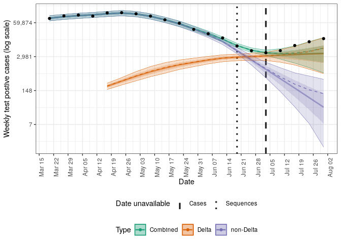
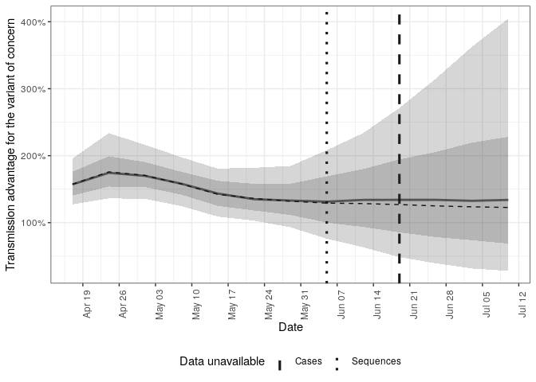

<!-- README.md is generated from README.Rmd. Please edit that file -->

# Forecast case notifications using variant of concern strain dynamics

[](https://github.com/epiforecasts/forecast.vocs/actions/workflows/R-CMD-check.yaml)

This package contains models and processing code to allow sequencing of
variants of concern to be used to forecast case notifications.

## Installation

Either install the package from GitHub using the following,

``` r
devtools::install_github("epiforecasts/forecast.vocs", dependencies = TRUE)
```

Install stan to enable model fitting and forecasting using:

``` r
cmdstanr::install_cmdstan()
```

## Quick start

This quick start uses data from Germany that includes COVID-19
notificatons and sequences with sequences either being positive or
negative for the Delta variant.

### Step by step forecast

``` r
library(forecast.vocs)
options(mc.cores = 4)

obs <- filter_by_availability(
  germany_covid19_delta_obs,
  date = as.Date("2021-07-05")
)
curr_obs <- latest_obs(germany_covid19_delta_obs)

dt <- stan_data(obs, horizon = 4)

model <- load_model(strains = 2)

inits <- stan_inits(dt, strains = 2)

fit <- stan_fit(
  data = dt, model = model, init = inits,
  adapt_delta = 0.99, max_treedepth = 15,
  refresh = 0, show_messages = FALSE
)
#> Running MCMC with 4 parallel chains...
#> 
#> Chain 3 finished in 89.2 seconds.
#> Chain 1 finished in 102.9 seconds.
#> Chain 4 finished in 106.6 seconds.
#> Chain 2 finished in 133.0 seconds.
#> 
#> All 4 chains finished successfully.
#> Mean chain execution time: 107.9 seconds.
#> Total execution time: 133.1 seconds.
#> 
#> Warning: 1 of 4000 (0.0%) transitions ended with a divergence.
#> This may indicate insufficient exploration of the posterior distribution.
#> Possible remedies include: 
#>   * Increasing adapt_delta closer to 1 (default is 0.8) 
#>   * Reparameterizing the model (e.g. using a non-centered parameterization)
#>   * Using informative or weakly informative prior distributions

posterior <- summarise_posterior(fit)
posterior <- update_voc_label(posterior, "Delta")
```

Plot the posterior prediction for cases.

``` r
plot_cases(posterior, curr_obs, log = TRUE)
```



Plot the posterior prediction for the fraction of cases that have the
Delta variant.

``` r
plot_voc(posterior, curr_obs, voc_label = "Delta variant")
```


Plot the posterior estimate for the effective reproduction number of
Delta and non-Delta cases.

``` r
plot_rt(posterior)
```


### Forecast wrapper

Run a complete forecast for both the one and two strain models using the
`forecast` function (change the `save_path` argument to alter the
location where results are saved). See `names(results)` for a breakdown
of the output (including summarised posteriors and plots).

``` r
results <- forecast(obs,
  strains = c(1, 2),
  adapt_delta = 0.99, max_treedepth = 15,
  refresh = 0, show_messages = FALSE
)
#> Running MCMC with 4 parallel chains...
#> 
#> Chain 2 finished in 32.4 seconds.
#> Chain 4 finished in 33.5 seconds.
#> Chain 1 finished in 36.7 seconds.
#> Chain 3 finished in 39.5 seconds.
#> 
#> All 4 chains finished successfully.
#> Mean chain execution time: 35.5 seconds.
#> Total execution time: 39.7 seconds.
#> Running MCMC with 4 parallel chains...
#> 
#> Chain 4 finished in 86.1 seconds.
#> Chain 3 finished in 86.9 seconds.
#> Chain 1 finished in 98.5 seconds.
#> Chain 2 finished in 103.7 seconds.
#> 
#> All 4 chains finished successfully.
#> Mean chain execution time: 93.8 seconds.
#> Total execution time: 103.7 seconds.
```

Update variant of concern labels for the summarised posterior estimates.

``` r
results$posteriors <- update_voc_label(results$posteriors, "Delta")
```

Generate summary plots for the forecasts:

``` r
plots <- plot_posterior(
  results$posteriors, curr_obs,
  voc_label = "Delta variant"
)
```

Plot the posterior prediction for cases for both models.

``` r
plots$log_cases
```


Plot the posterior estimate for the effective reproduction number of
Delta, non-Delta cases, and overall.

``` r
plots$rt
```


