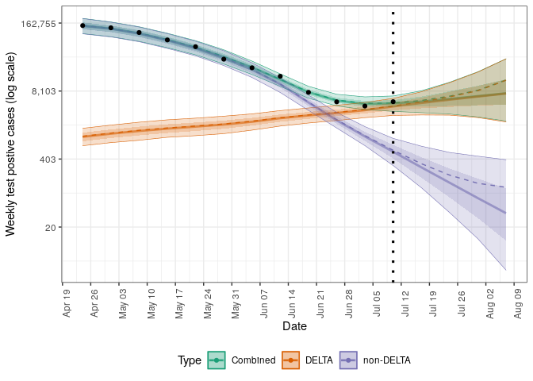
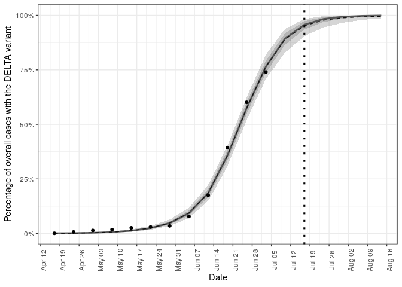
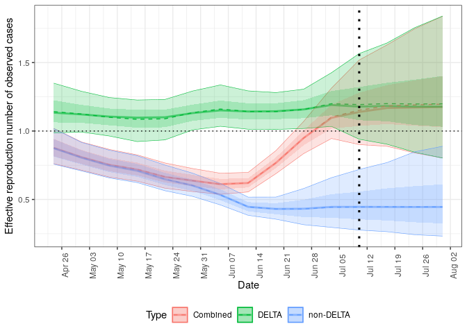
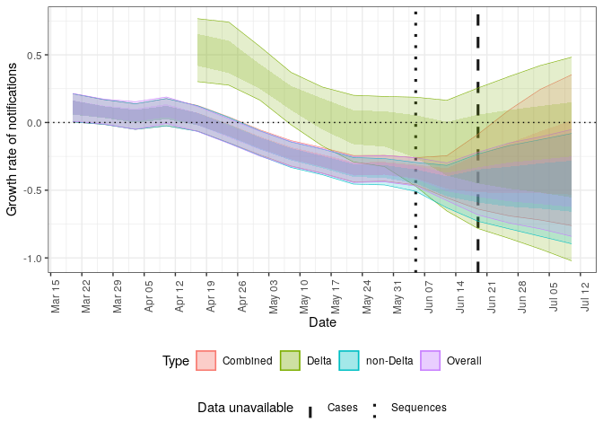
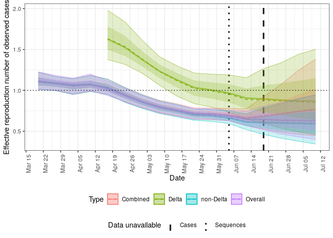

<!-- README.md is generated from README.Rmd. Please edit that file -->

# Evaluating the impact of modelling strain dynamics on short-term COVID-19 forecast performance

[](https://github.com/epiforecasts/bp.delta/actions/workflows/R-CMD-check.yaml)
[](https://github.com/epiforecasts/bp.delta/actions/workflows/paper.yaml)

This repository contains stan code for one and two strain branching
process process models as well as an R package for using these models to
produce forecasts of COVID-19 notified cass in Germany. See the paper
for further method details and the rest of this README for installation
and example functionality.

## Installation

Either install the package from GitHub using the following,

``` r
devtools::install_github("seabbs/bp.delta", dependencies = TRUE)
```

Or install the package locally (with the working directory at the
package root),

``` r
devtools::install_dev_deps()
devtools::load_all()
```

Install stan using:

``` r
cmdstanr::install_cmdstan()
```

## Using the model

### Step by step forecast

*Note: Stan throws some initialisation warnings at the moment and a low
number of divergent transitions (\<0.5%) regardless of auto-regressive
model formulation or stan settings. This is a work in progress - remove
the `refresh = 0, show_messages = FALSE` settings to see these issues.*

``` r
library(bp.delta)
options(mc.cores = 4)

obs <- latest_obs(germany_obs)

dt <- stan_data(obs, horizon = 4)

model <- load_model(strains = 2)

inits <- stan_inits(dt, strains = 2)

fit <- stan_fit(
  data = dt, model = model, init = inits,
  adapt_delta = 0.99, max_treedepth = 15,
  refresh = 0, show_messages = FALSE
)
#> Running MCMC with 4 parallel chains...
#> 
#> Chain 2 finished in 14.8 seconds.
#> Chain 4 finished in 18.0 seconds.
#> Chain 1 finished in 21.5 seconds.
#> Chain 3 finished in 25.0 seconds.
#> 
#> All 4 chains finished successfully.
#> Mean chain execution time: 19.8 seconds.
#> Total execution time: 25.2 seconds.
#> 
#> Warning: 16 of 4000 (0.0%) transitions ended with a divergence.
#> This may indicate insufficient exploration of the posterior distribution.
#> Possible remedies include: 
#>   * Increasing adapt_delta closer to 1 (default is 0.8) 
#>   * Reparameterizing the model (e.g. using a non-centered parameterization)
#>   * Using informative or weakly informative prior distributions
#> Processing csv files: /tmp/RtmpmVfgIR/twostrainbp-202107161607-1-7f7b9d.csv, /tmp/RtmpmVfgIR/twostrainbp-202107161607-2-7f7b9d.csv, /tmp/RtmpmVfgIR/twostrainbp-202107161607-3-7f7b9d.csv, /tmp/RtmpmVfgIR/twostrainbp-202107161607-4-7f7b9d.csv
#> 
#> Checking sampler transitions treedepth.
#> Treedepth satisfactory for all transitions.
#> 
#> Checking sampler transitions for divergences.
#> 16 of 4000 (0.4%) transitions ended with a divergence.
#> These divergent transitions indicate that HMC is not fully able to explore the posterior distribution.
#> Try increasing adapt delta closer to 1.
#> If this doesn't remove all divergences, try to reparameterize the model.
#> 
#> Checking E-BFMI - sampler transitions HMC potential energy.
#> E-BFMI satisfactory.
#> 
#> Effective sample size satisfactory.
#> 
#> Split R-hat values satisfactory all parameters.
#> 
#> Processing complete.

posterior <- summarise_posterior(fit)
```

Plot the posterior prediction for cases.

``` r
plot_cases(posterior, obs, max(obs$date), log = TRUE)
```



Plot the posterior prediction for the fraction of cases that are DELTA.

``` r
plot_delta(posterior, obs, max(obs$date))
#> Warning: Removed 1 rows containing missing values (geom_point).
```



Plot the posterior estimate for the effective reproduction number of
DELTA and non-DELTA cases.

``` r
plot_rt(posterior, max(obs$date))
```



### Forecast wrapper

Run a complete forecast for both the one and two strain models using the
`forecast` function (change the `save_path` argument to alter the
location where results are saved). See `names(results)` for a breakdown
of the output (including summarised posteriors and plots).

``` r
results <- forecast(obs,
  strains = c(1, 2),
  adapt_delta = 0.99, max_treedepth = 15,
  refresh = 0, show_messages = FALSE
)
#> Running MCMC with 4 parallel chains...
#> 
#> Chain 3 finished in 5.4 seconds.
#> Chain 4 finished in 6.8 seconds.
#> Chain 2 finished in 7.0 seconds.
#> Chain 1 finished in 9.6 seconds.
#> 
#> All 4 chains finished successfully.
#> Mean chain execution time: 7.2 seconds.
#> Total execution time: 9.7 seconds.
#> Processing csv files: /tmp/RtmpmVfgIR/bp-202107161608-1-5bc9a4.csv, /tmp/RtmpmVfgIR/bp-202107161608-2-5bc9a4.csv, /tmp/RtmpmVfgIR/bp-202107161608-3-5bc9a4.csv, /tmp/RtmpmVfgIR/bp-202107161608-4-5bc9a4.csv
#> 
#> Checking sampler transitions treedepth.
#> Treedepth satisfactory for all transitions.
#> 
#> Checking sampler transitions for divergences.
#> 19 of 4000 (0.47%) transitions ended with a divergence.
#> These divergent transitions indicate that HMC is not fully able to explore the posterior distribution.
#> Try increasing adapt delta closer to 1.
#> If this doesn't remove all divergences, try to reparameterize the model.
#> 
#> Checking E-BFMI - sampler transitions HMC potential energy.
#> E-BFMI satisfactory.
#> 
#> Effective sample size satisfactory.
#> 
#> Split R-hat values satisfactory all parameters.
#> 
#> Processing complete.
#> Running MCMC with 4 parallel chains...
#> 
#> Chain 2 finished in 14.3 seconds.
#> Chain 4 finished in 16.3 seconds.
#> Chain 1 finished in 16.7 seconds.
#> Chain 3 finished in 22.8 seconds.
#> 
#> All 4 chains finished successfully.
#> Mean chain execution time: 17.5 seconds.
#> Total execution time: 22.8 seconds.
#> Processing csv files: /tmp/RtmpmVfgIR/twostrainbp-202107161608-1-1b48a0.csv, /tmp/RtmpmVfgIR/twostrainbp-202107161608-2-1b48a0.csv, /tmp/RtmpmVfgIR/twostrainbp-202107161608-3-1b48a0.csv, /tmp/RtmpmVfgIR/twostrainbp-202107161608-4-1b48a0.csv
#> 
#> Checking sampler transitions treedepth.
#> Treedepth satisfactory for all transitions.
#> 
#> Checking sampler transitions for divergences.
#> 12 of 4000 (0.3%) transitions ended with a divergence.
#> These divergent transitions indicate that HMC is not fully able to explore the posterior distribution.
#> Try increasing adapt delta closer to 1.
#> If this doesn't remove all divergences, try to reparameterize the model.
#> 
#> Checking E-BFMI - sampler transitions HMC potential energy.
#> E-BFMI satisfactory.
#> 
#> Effective sample size satisfactory.
#> 
#> Split R-hat values satisfactory all parameters.
#> 
#> Processing complete.
#> Warning: Removed 1 rows containing missing values (geom_point).
```

Plot the posterior prediction for cases for both models.

``` r
results$plots$log_cases
```



Plot the posterior estimate for the effective reproduction number of
DELTA, non-DELTA cases, and overall.

``` r
results$plots$rt
```



### Further details

See the following for more detailed analysis:

  - `inst/analysis/germany/forecast.R:` for a forecasting application.
  - `inst/analysis/germany/retrospective.R` for retrospective fitting
    and model evaluation
